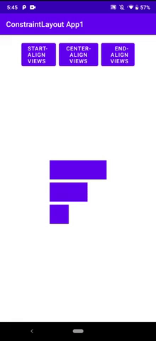

# Flow horizontal alignment example

This Android application demonstrates how to vertically stack and horizontally align referenced widgets in a [Flow](https://developer.android.com/reference/androidx/constraintlayout/helper/widget/Flow) virtual layout.

The application consists of a single activity named [MainActivity](src/main/java/com/tazkiyatech/constraintlayout/app1/MainActivity.kt) and a layout file for this activity named [activity_main.xml](src/main/res/layout/activity_main.xml).

The [activity_main.xml](src/main/res/layout/activity_main.xml) layout file defines a [Flow](https://developer.android.com/reference/androidx/constraintlayout/helper/widget/Flow) virtual layout with the following properties:

1. It tightly wraps its referenced widgets by virtue of having a `layout_height` and `layout_width` value of `wrap_content`.
2. It vertically stacks its referenced widgets by virtue of having a `orientation` value of `vertical`.
3. It horizontally aligns its referenced widgets by means of the `flow_horizontalAlign` property.

The [activity_main.xml](src/main/res/layout/activity_main.xml) layout file also offers buttons outside of the ConstraintLayout which offer the ability to change the horizontal alignment of the views in the [Flow](https://developer.android.com/reference/androidx/constraintlayout/helper/widget/Flow) virtual layout, as follows:

