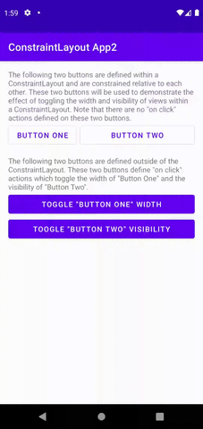

# Toggle view width and view visibility example

This Android application demonstrates the effect of toggling the width and visibility of views within a ConstraintLayout.

The application consists of a single activity named [MainActivity](src/main/java/com/tazkiyatech/constraintlayout/app2/MainActivity.kt) and a layout file for this activity named [activity_main.xml](src/main/res/layout/activity_main.xml).

The [activity_main.xml](src/main/res/layout/activity_main.xml) layout file defines two buttons (`button1` and `button2`) which are constrained relative to each other. This layout file also offers buttons outside of the ConstraintLayout for toggling the width of `button1` and the visibility of `button2`, as follows:

